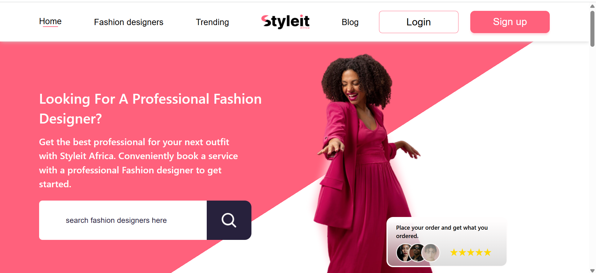
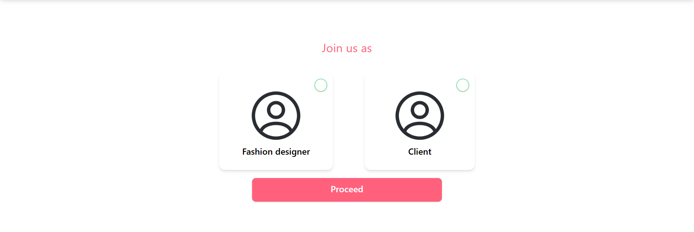

# Styleit Africa

A modern web platform that connects fashion designers with clients, enabling designers to showcase their collections and clients to book appointments seamlessly.



## Overview

This platform serves as a bridge between fashion designers and potential clients, providing an elegant space for designers to present their work and for clients to schedule consultations or fittings.


## Features

### For Designers
- **Portfolio Management**: Upload and organize fashion designs with high-quality images
- **Client Communication**: Receive and respond to booking requests
- **Profile Customization**: Showcase expertise and style specialties
### For Clients
- **Design Gallery**: Browse designer portfolios and collections
- **Designer Discovery**: Search and filter designers by name or location
- **Easy Booking**: Schedule appointments directly through the platform
- **Appointment Management**: View, modify, or cancel bookings

## Technology Stack

- Frontend: React.js 
- Backend: python
- Database: mysql
- Authentication: JWT
- Payment Integration: paystack

## Usage

### For Designers
1. Register and create your designer profile
2. Upload your designs for clients to view and increase appointment scheduling rates
4. Receive and manage booking requests from clients

### For Clients
1. Browse the designer gallery
2. View designer profile and designs
3. Select a designer 
4. Submit booking request
5. Receive confirmation and appointment details


## Installation

```bash
# Clone the repository
git clone [repository-url]

# Install dependencies
npm install


# Run the development server
npm run dev


## Contributing as a team

1. Create a feature branch (`git checkout -b feature/AmazingFeature`)
2. Commit your changes (`git commit -m 'Add some AmazingFeature'`)
3. Push to the branch (`git push origin feature/AmazingFeature`)
4. assign a team member to review the branch and merge it to the master branch
5. wait to be notified to pull the changes to the master branch 

```
**Note**: This is an active project under development. Features and documentation are subjected to changes.